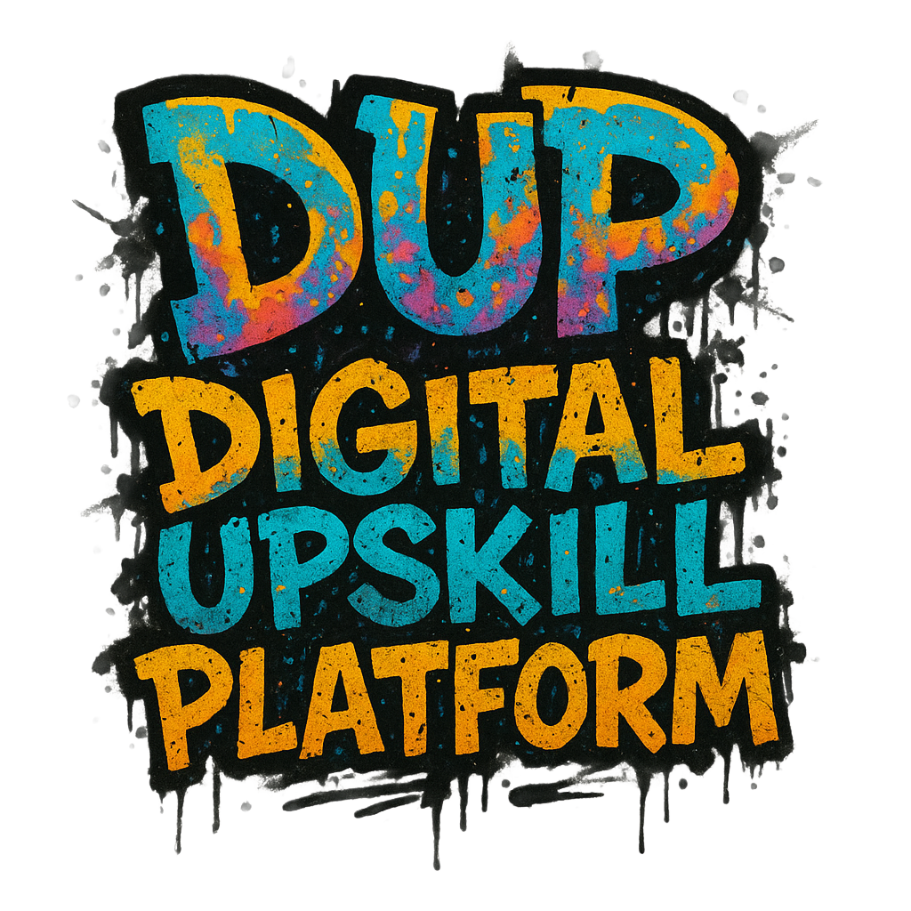

# 🚀 DUP – Digital Upskill Platform

<p align="center">
    
</p>

**DUP** is a modern, guided self-paced learning platform designed to help educators and learners build skills through structured learning journeys, with visual progression and milestone-based unlocking. Built for flexibility, DUP supports any subject, any structure, and adapts for both internal company use and future SaaS delivery.

> 🚧 This project is under active development. Features and structure may evolve.

---

## 🌟 Vision

> “DUP helps educators and learners follow structured skill-building journeys with visual progress tracking and milestone-based development — so that every step in the learning process feels meaningful, clear, and empowering.”

Our goal is to create a platform that supports upskilling through clarity, modularity, and smart progression design. Inspired by tools like [Loops Education](https://loopseducation.com), DUP is being built to combine engagement, structure, and accessibility.

---

## 🚀 Features (Planned & In Progress)

### 🧑‍🏫 User Roles
- Admin – manage users, organizations, and global settings
- Teacher – build and manage courses
- Student – participate in learning journeys

### 📚 Course & Content Structure
- Create courses → modules → lessons → steps
- Visual learning path builder
- Unlock-based progression (cannot skip ahead)
- Reusable templates for lessons

### 📝 Learning & Evaluation
- Self-check quizzes
- Teacher-reviewed assignments
- XP points, progress meters, and gamified unlocks
- Optional certifications upon completion

### 🧠 Platform Features
- Role-based authentication & onboarding
- Invite-based account creation
- Two-factor authentication (first login)
- File uploads: PDF, video, audio
- Comments and feedback fields
- Student dashboard with clear visual progress

### 📊 Future Enhancements
- Admin-level analytics (per organization)
- Timed challenges and gamified mini-quests
- Multi-organization support (DUPaaS)
- Advanced certificate generator
- Mobile-friendly version

---

## 🛠️ Tech Stack

| Layer       | Tech              |
|-------------|-------------------|
| Frontend    | React + Vite      |
| Styling     | Tailwind CSS      |
| Backend     | Node.js + Express |
| Database    | PostgreSQL        |
| Hosting     | Neon (free-tier for MVP) |
| Auth        | JWT + Email-based login |
| Versioning  | GitHub (public repo)      |

---

## 📦 Project Structure
```
/dup-app
├── /frontend → React/Vite frontend
├── /backend → Express + PostgreSQL API
└── README.md
```

---

## 📝 Project Commands
- run `npm install` to install dependencies  
- run `npm run dev` to start the development server  
- run `npm run build` to build the project for production  
- run `npm run initdb` to initialize the database  

## 💡 Why public?

This repo is public to showcase the development journey of a real-world, fullstack platform.  
Feel free to follow along, contribute ideas, or fork it for your own educational use.

---

## 👋 Author

Created by **Robert Ahlin** at [i4 Solutions AB](https://i4solutions.se)  
Contact: [robert.ahlin@i4solutions.se]

---

## 📄 License

This project is open for inspiration and educational use during development. Commercial reuse not permitted without permission.
