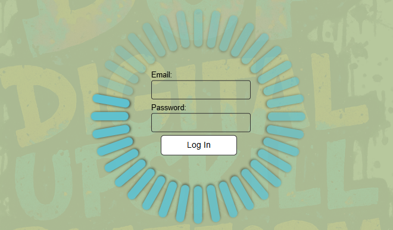
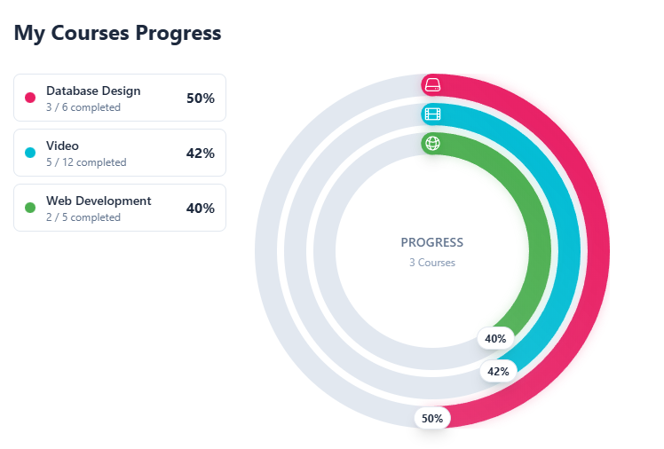

# 🚀 DUP – Digital Upskill Platform
_A full‑stack MVP for structured, visual and self‑paced learning_

<p align="center">
  
</p>

**DUP** (Digital Upskill Platform) is a modern digital learning platform developed as a full‑stack examination project. The system combines **visual course progression**, **automatic unlock rules**, **self‑grading quizzes**, **role‑based dashboards**, and a **graph‑based course builder**, built entirely from scratch using React, Express, and PostgreSQL.

The platform is delivered as a **Minimum Viable Product (MVP)** with focus on scalable architecture, user‑centered design, and clean technical structure.

> 🛠️ **Status:** Active development – more features planned.

---

## 🌟 Vision

> “To provide educators and learners with a clear, visual and engaging learning journey that makes every step meaningful, understandable, and structured — without adding administrative complexity.”

---

## ✨ MVP Features

### 👥 Roles & Access Control
- **Admin** – manage users, roles, courses
- **Teacher** – build courses, monitor learners
- **Student** – follow structured learning paths

### 📚 Course Design & Content
- Graph‑based **Course Builder** using React Flow
- Hubs (modules) and Tasks (steps)
- Drag‑and‑drop layout with saved coordinates
- JSONB‑based content storage (flexible + versioning)
- SimpleEditor & QuizEditor

### 🧠 Learning & Progression
- Self‑grading quizzes (3 or 5 randomized questions)
- Automatic unlocking of next hubs
- Task, hub and course progression tracking
- Automatic course certificates (MVP)

### 🔔 Real‑Time Features
- Built with Socket.IO
  - live activity log
  - student notifications
  - instant updates when editing course nodes

### 📊 Dashboards
**Student:** progress bars (linear + circular), notifications

**Teacher:** course completion overview, student activity

**Admin:** CRUD for users and courses

---

## 🛠️ Tech Stack

| Layer | Technologies |
|-------|--------------|
| Frontend | React (Vite + TypeScript), Tailwind CSS, React Flow |
| Backend | Node.js, Express, Socket.IO |
| Database | PostgreSQL (Neon) |
| Auth | JWT in HttpOnly cookies |
| Hosting (dev) | Local + Neon |
| Tools | GitHub, Postman, Figma |

---

## 🧩 Architecture Overview

The project is structured as a full‑stack monorepo:

```
/dup-app
├── /frontend   # React + Vite + Tailwind
├── /backend    # Express API + Socket.IO + PostgreSQL
└── README.md
```

Backend follows a layered RESTful structure using controllers, middleware and database services.  
The database uses:

- **ENUM types** for data integrity
- **JSONB** for flexible content and drafts
- **Triggers** for automatic `updated_at`
- **Graph-based design** using hubs, tasks and edges

---

## 🔌 API – Summary

### Auth
```
POST /api/auth/login
POST /api/auth/logout
```

### Users
```
GET    /api/users
POST   /api/users
PUT    /api/users/:id
DELETE /api/users/:id
```

### Courses
```
GET    /api/courses
POST   /api/courses
PUT    /api/courses/:id
PATCH  /api/courses/:id/lock
DELETE /api/courses/:id
```

### Progress
```
PUT /api/tasks/:taskId/progress
PUT /api/hubs/:hubId/progress
```

### Certificates
```
GET /api/certificates/my
```

### Quizzes
```
GET    /api/quizzes
POST   /api/quizzes
PUT    /api/quizzes/:id
DELETE /api/quizzes/:id
```

---

## 🧪 Development Commands

### Frontend
```
cd frontend
npm install
npm run dev
npm run build
```

### Backend
```
cd backend
npm install
npm run dev
npm run initdb
```

---

## 🖼️ UI Preview

### Login


### Student Dashboard


### Course Builder – Hubs & Tasks


---

## 📦 Deployment

The project is designed for deployment on:

- **TBA** (frontend)
- **TBA** (backend)
- **Neon** as production PostgreSQL

The MVP is tested locally and with Neon.

---

## 👤 Author

**Robert Ahlin**  
Full‑Stack Developer & Digital Solutions  
GitHub: https://github.com/RobertAhlin

---

## 📄 License

Open for learning, inspiration and non‑commercial use.  
Contact for commercial usage permissions.

